# Software Hacktory: 0 → 1

## Harness Engineering from First Principles — Presentation Sourcebook

> **Core thesis:** The model provides capability. The harness turns that capability into useful outcomes that are consistently correct, verifiable, affordable, recoverable, and easy to produce.

This document collects the workshop narrative, presentation ideas, diagrams, demo progression, metrics, handwritten notes, and rehearsal safeguards in one place. It is intentionally a sourcebook rather than a finished slide deck: the strongest pieces can be selected and compressed into the final presentation.

---

## Workshop alignment review

The plan is aligned with the original workshop promise: begin with a bare model, progressively engineer the environment around it, and end with a visible software factory that plans, executes, verifies, recovers, and learns from trajectories.

The additions in this revision strengthen that story rather than create new side quests:

- **DeepSeek Harness architecture** explains the concrete runtime in which the workshop is implemented.
- **Cordis and its paper** explain why the runtime can safely compose and replace capabilities dynamically.
- **Sandbox orchestration** turns DevTeam from a diagram of several agents into an implementable and safer Simple Code execution model.
- **Prime Agent** becomes a short case study connecting RLM-style programmable context with continual harness refinement.

The sourcebook is intentionally broader than the presentation. For the live 47-minute programmed portion, use this priority:

| Priority | Material | Treatment |
|---|---|---|
| Core | Outcome quality, loop, verification, recovery | Explain and demonstrate |
| Core | DeepSeek Harness components | One architecture slide plus references during the build |
| Core | One sandbox per parallel writer | Show visually during DevTeam |
| Core | Trajectory → reusable improvement | Demonstrate once |
| Brief | Cordis paper | One intuitive slide; avoid the formal calculus |
| Brief | Prime Agent | Two-minute case study after RefineLoop |
| Optional | Meta harness, RL, framework comparisons | Mention only if time remains |

The workshop should not attempt to implement every idea in the sourcebook on stage. The DeepSeek Harness configuration and Simple Code codebase should be prepared in advance; the audience experiences the capabilities being revealed progressively.

## 1. The idea the entire workshop should defend

Harness engineering is not mainly about making an AI solve the hardest imaginable problem once.

Most software engineers are not spending every day solving the Navier–Stokes equations or an exotic scientific benchmark. They are handling ordinary but valuable work:

- understanding a ticket correctly;
- changing the right part of a codebase;
- preserving existing behavior;
- following an organization’s conventions;
- testing edge cases;
- recovering from failures;
- communicating what changed;
- completing the work without excessive cost or supervision.

The real challenge is not:

> Can a model produce one impressive answer?

It is:

> Can a system solve the right problem, at the required quality, repeatedly and economically—even when the path contains ambiguity, tool failures, incomplete information, and mistakes?

This gives harness engineering two inseparable responsibilities.

### Responsibility 1 — Outcome quality

The system must solve the actual problem rather than merely generate plausible-looking work.

Questions to ask:

- Did it understand the user’s intent?
- Did it satisfy the acceptance criteria?
- Is the result technically and product-wise correct?
- Did it preserve constraints and avoid regressions?
- Can an independent verifier demonstrate that it worked?

### Responsibility 2 — Operational quality

The system must produce that outcome consistently, affordably, and with manageable effort.

Questions to ask:

- Does it work across repeated runs rather than only in a cherry-picked demo?
- Can it recover from local failures?
- How much human intervention does it require?
- What are its time, token, compute, and monetary costs?
- Can we understand why it acted as it did?
- Can we improve the system using evidence from previous runs?

A useful shorthand is:

$$
\text{Practical Agent Value}
\propto
\frac{\text{Outcome Quality} \times \text{Consistency} \times \text{Verifiability}}
{\text{Cost} \times \text{Latency} \times \text{Human Effort}}
$$

This is not intended as a literal universal formula. It is a design lens: improving a benchmark score while making the system much more expensive, fragile, or difficult to operate may not create more practical value.

### The line to repeat throughout the workshop

> **A capable model can solve a problem. A good harness makes the solution dependable.**

Alternative closing form:

> **Intelligence gets you an answer. Engineering gets you the right answer consistently.**

---

## 2. What harness engineering means

> **A harness is the runtime system that controls what an AI sees, what it can do, how it progresses, how its work is evaluated, and what happens next.**

It includes more than tools or a long system prompt.

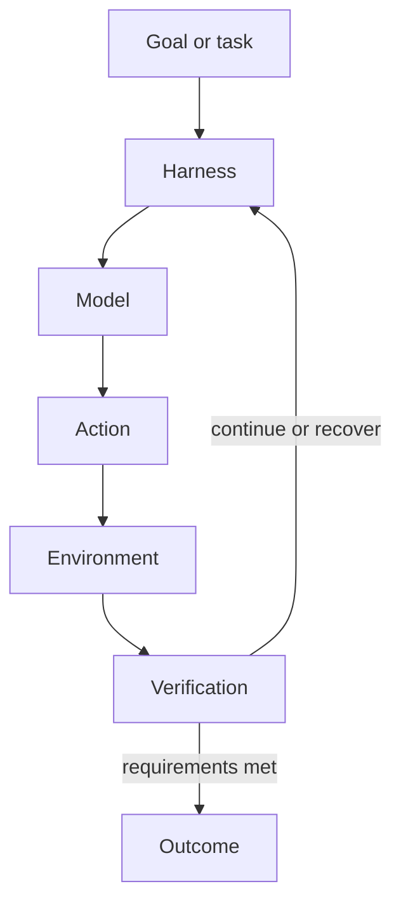

The harness may own:

- task definition and acceptance criteria;
- context selection and compression;
- state and memory;
- tools, permissions, and execution environments;
- the agent loop and stopping conditions;
- subagents and orchestration;
- verification and evaluation;
- failure classification, retry, rollback, and escalation;
- observability of traces, cost, duration, and outcomes;
- learning from successful, failed, and recovered trajectories;
- human checkpoints and authority boundaries.

Everything surrounding the model is not incidental plumbing. It determines whether the model’s latent capability becomes a trustworthy system.

---

## 3. The audience’s emotional journey

“Start from zero” should describe the audience’s mental journey, not require us to gamble the session on uncontrolled generation.

The session should feel like one system evolving in front of them:

> “Here is an LLM.”  
> “Let us give it hands.”  
> “Let us give it feedback.”  
> “Let us give it coworkers with bounded context.”  
> “Let us make it prove its work.”  
> “Let us make it recover.”  
> “Now let us help the system retain what it learned.”

At minute one:

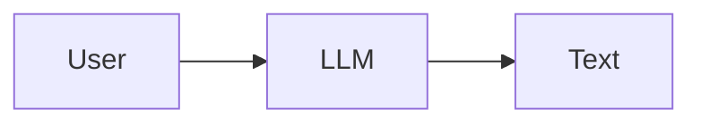

Near the end:

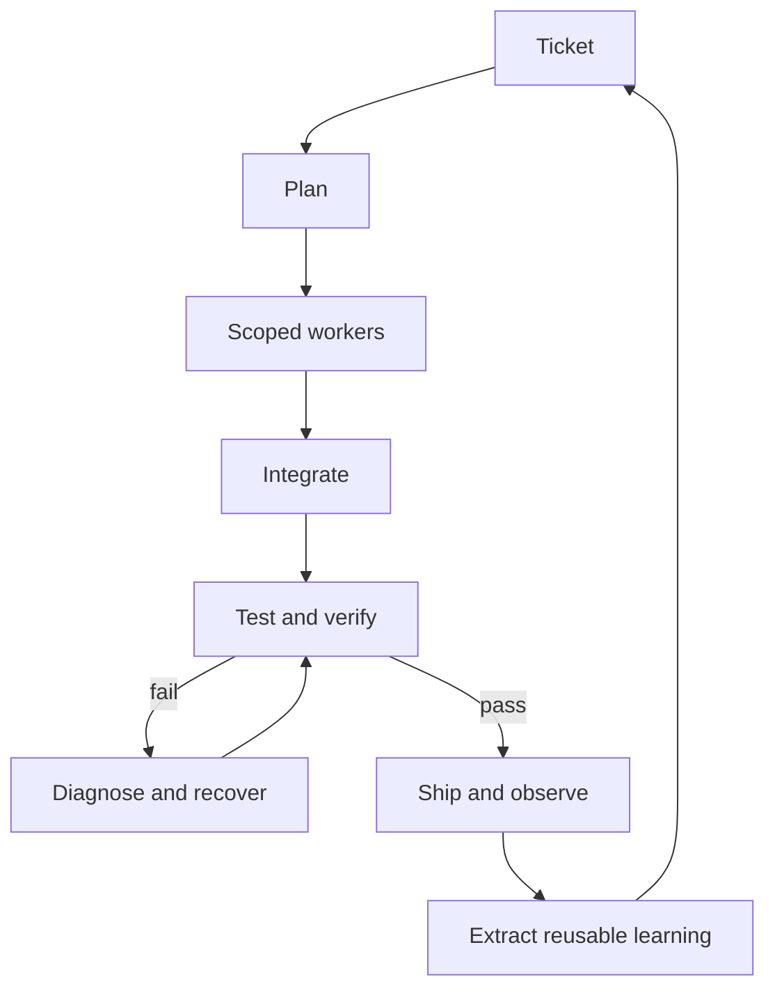

The desired audience reaction is not merely “that model is smart.” It is:

> **“I did not realize these ordinary components could be assembled into a system this capable—and I could build a version of it.”**

---

## 4. The three planned “wow” moments

### Wow 1 — Same model, different environment

Start with a naked model asked to implement a feature. It can describe the answer but cannot reliably execute it.

Then add repository access, file operations, terminal execution, and tests.

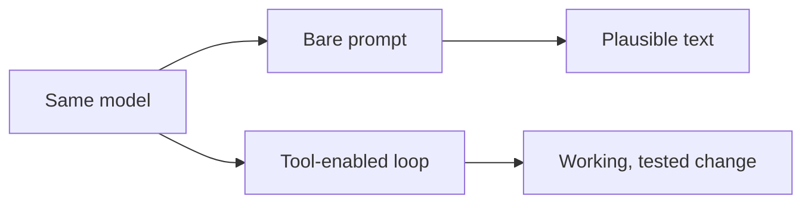

Pause and say:

> **The model did not become smarter. We changed what existed around it.**

### Wow 2 — One agent becomes a small organization

Give the parent a real ticket. Let it form a plan and create bounded sessions for backend, frontend, and testing.

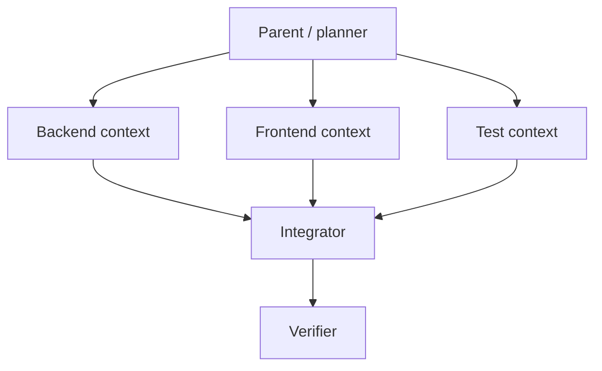

The key lesson is not “three models are better than one.” It is:

> **Subagents are a way to create bounded reasoning processes with the right context, tools, budget, and output contract.**

### Wow 3 — Failure becomes learning

Create a deterministic acceptance-test failure, let the system diagnose and recover, then extract a reusable skill or repository memory from the trajectory.

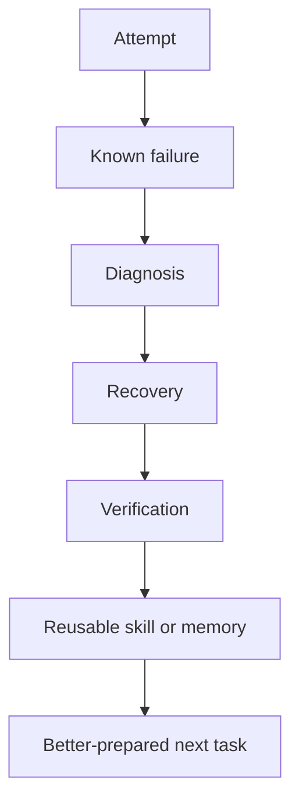

Then land the point:

> **Same model. No fine-tuning. No gradient update. The system became better prepared.**

Be precise: this is system-level learning through persistent guidance, memory, or skills—not an update to the model’s weights.

---

## 5. The 60-minute run of show

The session is **60 minutes total**. The final **13 minutes are protected** for assistance, questions, recovery, and timing variance. No new required concept belongs in that period.

| Time | What happens | Purpose |
|---:|---|---|
| 0–4 min | Hook: capable models, unreliable outcomes | Establish the gap |
| 4–8 min | The two jobs: outcome quality + operational quality | State the central thesis |
| 8–12 min | Audience builds the harness: “What does an AI engineer need?” | Make the definition participatory |
| 12–17 min | DeepSeek Harness + Cordis architecture | Show the implementation substrate |
| 17–24 min | H0 → H1: bare model to DevLoop | Wow 1 |
| 24–32 min | H2: DevTeam across isolated workspaces/sandboxes | Wow 2 |
| 32–39 min | H3: deterministic failure, verification, recovery | Reliability lesson |
| 39–43 min | H4: trajectory refinement + Prime Agent case study | Wow 3 and external reference |
| 43–47 min | Simple Code / software-factory architecture and takeaway | Complete the transformation |
| 47–60 min | Audience assistance, questions, rerun, or buffer | Protected; no new dependency |

### Timing discipline

- Slides should explain only what the audience is about to see or has just seen.
- The talk is not a survey of every agent paper or framework.
- If a segment runs long, skip an explanation—not the final outcome.
- The demo must reach a visible, verified completion by minute 47.

---

## 6. Suggested slide spine

This is a compact slide set; most of the experience should occur in the live environment.

### Slide 1 — Software Hacktory: 0 → 1

```text
SOFTWARE HACKTORY
0 → 1

Harness Engineering
from First Principles
```

Keep it nearly empty. Speak for no more than 30 seconds.

### Slide 2 — If models are this capable, what is missing?

Ask:

> If models can reason, code, plan, write, and debug, why has software engineering not become one API call?

Let the room answer.

### Slide 3 — A naked model is not a dependable worker

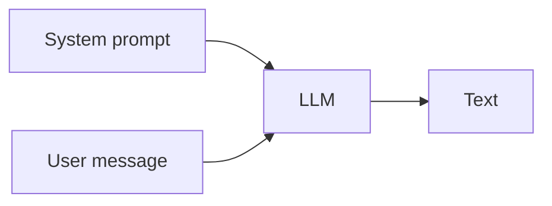

It does not automatically know the repository, run tests, preserve state, manage tickets, verify its work, recover reliably, or operate for long periods.

Reveal:

> **The intelligence is in the model. The reliability comes from the system around it.**

### Slide 4 — Agents are loops, not responses

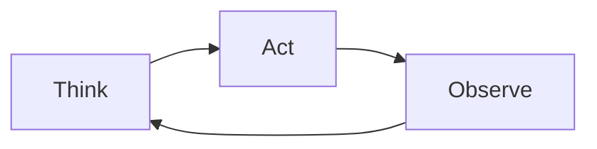

Translate it immediately into engineering:

```text
read code → form hypothesis → edit → run tests → inspect failure → fix
```

Do not lecture on ReAct history. Establish the primitive in two minutes.

### Slide 5 — What makes the result valuable?

Use the user’s core idea here.

```text
Not merely:
Can it solve X once?

But:
Can it solve X well,
repeatedly,
at acceptable cost,
with evidence,
and little friction?
```

This is the philosophical center of the talk.

### Slide 6 — Congratulations, you invented a harness

Begin with:

```text
TASK → ? → MODEL → ? → RESULT
```

Ask the audience what an AI software engineer needs. Add their answers live: repository, terminal, Git, tests, browser, ticketing, memory, subagents, verifier, recovery, and human control. Draw one box around everything and label it **HARNESS**.

### Slide 7 — Context is a decision, not a dump

> Context engineering is not “How do I fit everything into the prompt?” It is “What should this model see for this particular decision?”

Distinguish:

| Concept | Question | Example |
|---|---|---|
| State | What is happening now? | Tests 4 and 7 fail |
| Memory | What happened before? | This repo uses `pytest-asyncio` |
| Knowledge | What is generally known? | OAuth refresh-token rules |
| Skill | How is a reusable procedure performed? | Procedure for a DB migration |

### Slide 8 — Long-horizon reliability

Models may complete short tasks but lose coherence across longer, branching trajectories.

```text
Long-horizon performance
= model capability
+ context management
+ state
+ verification
+ recovery
+ memory
+ orchestration
```

> **Long-horizon intelligence is partly a model problem. Long-horizon reliability is an engineering problem.**

### Slide 9 — How do we know it is good?

Do not allow “it looked impressive” to be the evaluation.

```text
Outcome: Did it complete the correct task?
Process: Was the path safe and understandable?
Economics: What did completion cost?
Reliability: Does it work again?
Autonomy: How much human rescue was required?
```

### Slide 10 — Trajectories contain the evidence

```text
state₀ → action₁ → observation₁ → state₁ → ... → outcome
```

Compare success, failure, and recovery trajectories. Ask:

> Which contains the most reusable information?

Often, the recovery trajectory reveals the missing context, incorrect assumption, necessary check, or better procedure.

### Slide 11 — The model did not learn; the system did

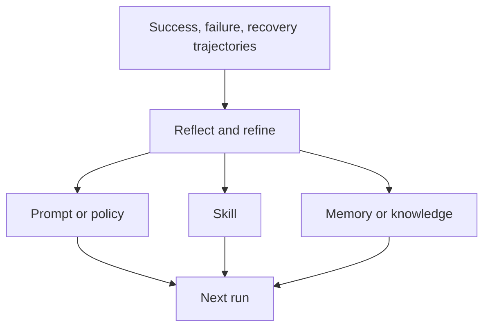

### Slide 12 — The principle

Full screen:

> **Build the smallest harness that closes the loop reliably.**

Harness complexity must be earned by a measurable improvement in outcomes, consistency, cost, speed, safety, or human effort.

### Final slide

> **The model is not the product. The harness is how the model becomes part of a dependable system.**

Underneath:

> **Build the loop. Measure the outcome. Learn from the trajectory. Improve the system.**

---

## 7. How DeepSeek Harness works

DeepSeek Harness is the implementation substrate for the workshop. Its useful architectural idea is not merely that it ships with many tools; it is that **every major capability is a replaceable plugin** composed through the Cordis runtime.

Primary references: [DeepSeek Harness repository](https://github.com/deepseek-ai/deepseek-harness), [architecture documentation](https://github.com/deepseek-ai/deepseek-harness/blob/master/docs/architecture.md), [Cordis primer](https://github.com/deepseek-ai/deepseek-harness/blob/master/docs/cordis-primer.md), and [official overview](https://www.deepseek.com/harness/en/).

### The runtime in one picture

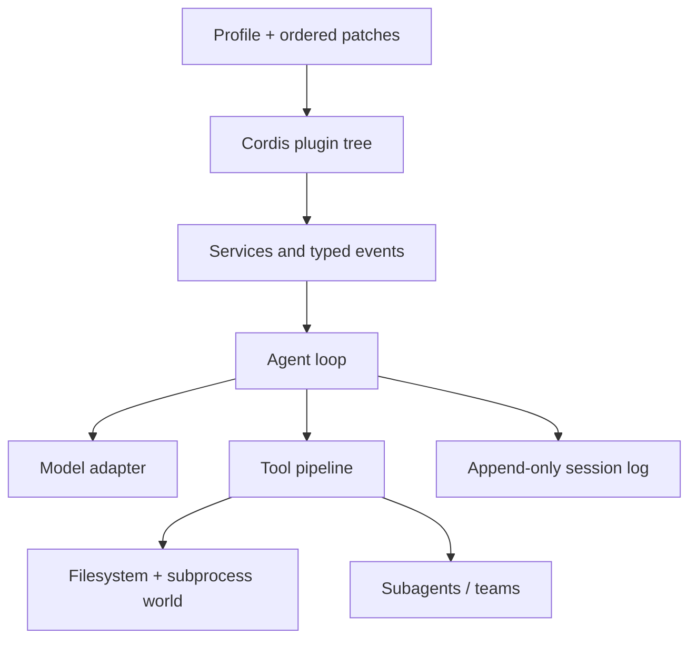

### The major components

| Component | What it owns | Why it matters to the workshop |
|---|---|---|
| Cordis context | Shared repository of services such as tools, models, sessions, and agents | Components depend on interfaces rather than concrete implementations |
| Plugins | Model adapters, tools, skills, sessions, sandboxes, storage, loops, scheduling, and UI | We can reveal and swap harness capabilities progressively |
| Profiles and bundles | Named compositions plus ordered configuration patches | H0–H4 can be separate presets built from shared pieces |
| System-prompt assembly | Prompt sections and tool schemas | Context and tool visibility are runtime composition decisions |
| Agent loop | Turns, steps, inbox claiming, model requests, and continuation | This is the concrete ReAct-style control loop |
| Tool registry and pipeline | Scoped discovery plus pre-execute, execute, and post-execute hooks | Permission checks, observability, and verification can intercept tool use |
| LLM adapter seam | Model request and streaming vocabulary | Local and frontier routes can be swapped without rewriting the loop |
| Session log | Append-only record of durable events | Trajectory inspection, resume, fork, replay, and later refinement share one source of truth |
| Scope | Per-agent registration boundary | A child can receive a different persona, tool set, or policy without mutating every agent |
| Sandbox and policy | Per-call file-effect confinement | Tools can run read-only, workspace-write, or with explicitly approved broader access |
| Subagent providers | One-shot and continuable child-agent backends | Delegation can use an in-process child or another agent runtime behind one interface |
| Agent Teams | Optional roster, durable mailbox, task DAG, and advisory write scopes | Provides a starting point for the DevTeam control plane |

### What happens during a turn

The detailed implementation is sophisticated, but the workshop explanation can stay simple:

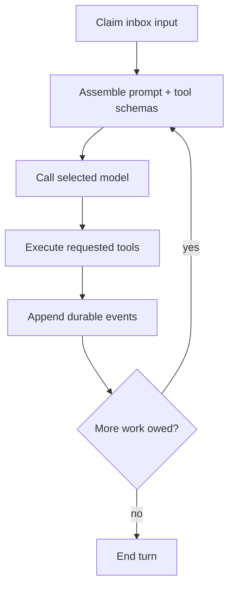

A **step** is one model request plus the tools it calls. A **turn** contains zero or more steps and ends when no more work is owed. Inputs, model messages, attempts, tool calls, and tool results become session events. This makes the loop inspectable without hard-coding observability into every tool.

The memorable engineering rule from the architecture is:

> **If the model saw it, the session log must be able to reconstruct it.**

That is why the same event stream can support the conversation view, trajectory view, resume, fork, search, replay, telemetry, and refinement.

### The four shipped modes as teaching aids

| Mode | Useful workshop interpretation |
|---|---|
| Minimal | Baseline with persistent shell and file editor |
| Standard | Full coding-agent composition with tools, planning, goals, skills, subagents, and workflows |
| Code | Standard capabilities exposed so model-generated TypeScript can orchestrate several tool operations programmatically |
| Creator | Runtime inspection, in-memory plugin experiments, and authoring new presets |

Use Minimal as H0, build or reveal H1–H4 as custom profiles/preset layers, and use Creator mode during preparation rather than spending stage time editing low-level configuration.

### How Cordis makes “everything is a plugin” work

Cordis can be explained in five ideas:

1. A plugin mounts behavior into a context.
2. The context is a repository of named services.
3. Plugins declare the services they require rather than depending on manual boot order.
4. Typed events allow observation, interception, ordered execution, or parallel fan-out.
5. Registrations are reversible effects, so unloading a plugin unwinds what it registered.

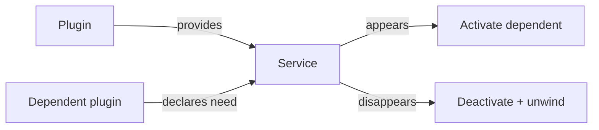

### The Cordis paper, decoded for this workshop

The paper behind Cordis is [*A Programming Paradigm for Spatiotemporal Composability*](https://arxiv.org/abs/2608.25512). It is a programming-languages and runtime-composition paper—not a new agent loop and not primarily a sandboxing paper.

It solves two problems that appear when a harness changes while it is running:

| Paper term | Plain-language meaning | Harness example |
|---|---|---|
| Temporal composability | When a component is removed, the runtime can undo the effects that component introduced | Unloading a tool plugin also removes its schemas, listeners, resources, and registrations |
| Spatial composability | Components declare dependencies and react when providers appear, disappear, or change | A tool activates only while the filesystem and permission services it requires are available |

The mechanism is:

- **revertible effects:** each context-changing operation carries an inverse that the runtime retains;
- **reactive coeffects:** each component declares what it needs from the surrounding context;
- **unified context mediation:** effects and dependencies pass through the same runtime context;
- **component lifecycle:** the runtime activates, deactivates, reloads, and reconciles components based on dependency satisfaction.

The practical payoff is easier to explain than the formalism:

> **A harness can add, remove, replace, and recombine capabilities without leaving stale registrations behind or forcing every plugin to know the concrete implementation of every dependency.**

This is especially relevant to future self-evolving harnesses. If an agent generates a new verifier, replaces a context strategy, or changes a sandbox provider, the runtime needs predictable teardown and dependency reconciliation. The paper supplies a formal foundation for that dynamic composition; it does not by itself decide whether the generated component is useful or safe.

### How H0–H4 map onto DeepSeek Harness

| Workshop stage | DeepSeek Harness implementation direction |
|---|---|
| H0 — Bare | Start from Minimal mode |
| H1 — DevLoop | Add repository/search tools, test commands, a verifier, and explicit stopping criteria as a profile layer |
| H2 — DevTeam | Compose a subagent provider or opt-in Agent Teams; scope persona, tools, model, context, and depth per child |
| H2 — Sandboxed workers | Add a Simple Code execution-world plugin that provisions a distinct workspace/branch/sandbox per parallel writer |
| H3 — RecoveryLoop | Intercept tool outcomes and verifier events; classify policy denial, infrastructure failure, and task failure separately |
| H4 — RefineLoop | Subscribe to completed session trajectories and propose small, reviewable updates to supplemental memory, skills, or policy |

DeepSeek’s built-in process sandbox is an important policy layer, but it is **same-world confinement**, not automatically a separate container or microVM for each agent. Whole-environment isolation requires swapping the filesystem and subprocess capability seams together so the agent sees one consistent remote execution world. This distinction is where Simple Code’s sandbox orchestrator enters.

### Native capability versus workshop extension

| Layer | Keep in DeepSeek Harness | Add as a plugin/adapter | Keep in Simple Code |
|---|---|---|---|
| Agent runtime | Model adapter, prompt assembly, loop, tools, session log | Custom verifier and trajectory exporter | Select runner and policy |
| Delegation | Subagent provider and continuable sessions | Simple Code-backed child provider | Cross-task DAG and leases |
| Execution | Per-call sandbox policy and capability seams | Remote filesystem/subprocess execution world | Provision containers/VMs and enforce infrastructure limits |
| Source control | Agent uses Git through tools | Typed commit/result reporting | Base commit, branch allocation, merge queue |
| Improvement | Session trajectory as evidence | Refinement proposal generator | Review, scope, version, promote, or reject lessons |

DeepSeek Harness is still described by its maintainers as a developer preview with compatibility-breaking changes expected. Pin the workshop to a tested commit or release, commit the lockfile, and keep Simple Code’s integration behind adapters rather than importing unstable internals throughout the codebase.

---

## 8. Harnesses to build in DeepSeek Harness

Use DeepSeek Harness as the laboratory, not as the subject of the workshop. The architecture should teach transferable principles even if the audience later uses a different runtime.

### H0 — Bare / Minimal baseline

**Question:** How far can model intelligence get with a primitive environment?

```text
Task → Model → Shell + Editor → Repository
```

Record tests passed, duration, tool calls, interventions, and whether the task was genuinely completed.

### H1 — DevLoop

**Purpose:** Turn generation into an execution and verification loop.

```text
inspect → modify → execute → observe → verify → repeat
```

Components:

- repository search and file access;
- editor and terminal;
- tests, lint, and type checking;
- explicit goal and task state;
- verifier and termination criteria.

Audience takeaway:

> **An agent is not an LLM that writes code. It is an LLM operating inside an environment and feedback loop.**

### H2 — DevTeam

**Purpose:** Decompose work into bounded contexts, isolated change sets, and controlled execution environments.

Each worker receives:

- a goal;
- relevant context;
- allowed tools and permissions;
- a budget;
- an output contract.

For parallel writers, it should also receive:

- its own branch or worktree;
- its own sandbox identity and resource budget;
- an explicit write scope;
- a declared artifact/commit handoff to the integrator.

It should not receive the complete history merely because it is available.

Audience takeaway:

> **Subagents are valuable when decomposition improves context, specialization, verification, or parallelism—not because a larger agent count looks impressive. Parallel reasoning is easy; safe parallel writing requires workspace and sandbox orchestration.**

### H3 — RecoveryLoop

**Purpose:** Convert local failure into useful information instead of terminal failure.

Add:

- acceptance-test verifier;
- failure classification;
- retry policy and alternative-strategy generation;
- rollback or checkpoint recovery;
- budgets and stop conditions;
- escalation to a human.

Audience takeaway:

```text
local failure ≠ task failure
```

### H4 — RefineLoop

**Purpose:** Use trajectories to make later runs better prepared.

```text
trajectories → reflection → refinement → skills/memory/guidance → next run
```

Example extracted skill:

```text
When implementing entity creation:
1. identify uniqueness constraints;
2. check existing entities before persistence;
3. test duplicate behavior explicitly;
4. return the expected domain-specific status.
```

Audience takeaway:

> **Continual improvement does not always require changing model weights. The runtime can retain better procedures, context, and policies.**

### Optional teaser — Meta Harness

Do not build this live. End with the question:

> What if the system could choose or compose the harness best suited to the task?

Possible design decisions:

- tool set;
- agent topology;
- context strategy;
- verifier;
- budgets and escalation policy;
- local versus frontier model routing.

---

## 9. Orchestrating agents across sandboxes — Simple Code architecture

Sandbox orchestration is not a side concern for Simple Code. Once several agents can execute code or edit the same project, it becomes the boundary between useful parallelism and corrupted workspaces, leaked credentials, nondeterministic merges, or unsafe host execution.

The architectural distinction to teach is:

| Boundary | What it isolates | What it does **not** isolate |
|---|---|---|
| Agent session | Conversation, reasoning context, goals, and trajectory | Filesystem writes or operating-system access |
| Git branch/worktree | Source changes and commit history | Processes, credentials, network, CPU, or memory |
| Sandbox | Filesystem/process/network/resource access, depending on provider | Semantic merge conflicts or task ownership |

> **A session isolates context. A branch or worktree isolates changes. A sandbox isolates execution. A reliable multi-agent coding system normally needs all three.**

### The recommended Simple Code topology

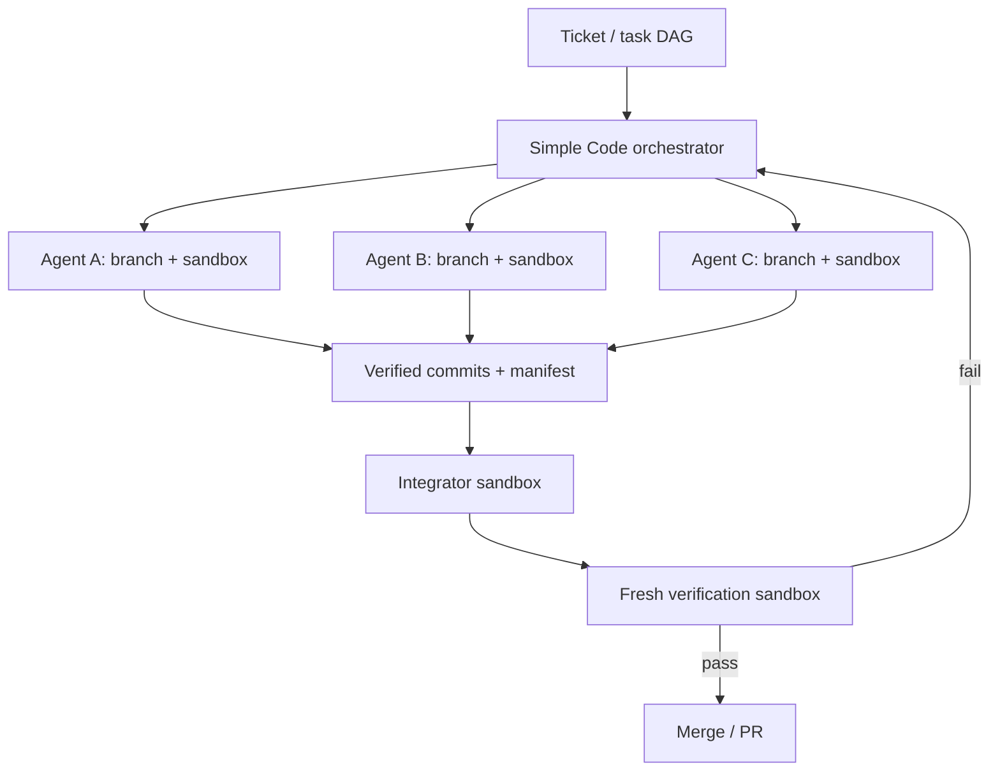

The orchestrator owns task state and lifecycle. Agents never decide that two writable jobs share a checkout merely because doing so is convenient.

### Lifecycle of one sandboxed task

1. **Resolve the task:** acceptance criteria, dependencies, model, tools, budgets, and write scope.
2. **Pin the source:** record the exact base commit; do not start from a moving branch name alone.
3. **Allocate a branch/worktree:** use a unique branch for every parallel writer.
4. **Create the sandbox:** provision the selected container, microVM, remote VM, or restricted local executor.
5. **Inject minimum capability:** project files, scoped credentials, environment, tool policy, and dependency cache.
6. **Run the agent:** stream events, tool calls, resource usage, and heartbeats into the run log.
7. **Verify locally:** run task-specific gates before accepting an artifact.
8. **Export a result manifest:** commits, patch, changed files, test evidence, cost, duration, and provenance.
9. **Integrate serially or by dependency level:** merge only verified outputs into an integration branch.
10. **Verify from a clean environment:** reproduce install/build/test without relying on leftover agent state.
11. **Publish or escalate:** open a PR on success; otherwise create a bounded repair task or request a human decision.
12. **Tear down:** revoke credentials, terminate descendants, close the sandbox, and apply retention policy to logs/artifacts.

### Control plane versus data plane

Keep the platform split cleanly:

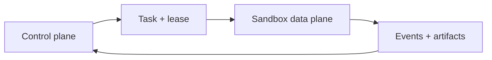

**Control plane responsibilities:**

- task DAG, readiness, ownership, leases, cancellation, retries, and budgets;
- sandbox-provider selection;
- branch and worktree allocation;
- credentials and policy decisions;
- durable event collection;
- verification, integration, and cleanup state.

**Data plane responsibilities:**

- execute the agent and its tools;
- expose a consistent filesystem and subprocess world;
- enforce resource and access policy;
- stream logs and heartbeats;
- return artifacts without directly mutating the orchestrator’s canonical checkout.

### A small open-source provider contract

Simple Code should avoid coupling orchestration to Docker, Kubernetes, E2B, Daytona, Vercel, or any single runtime. A deliberately small provider interface is enough:

```ts
interface SandboxProvider {
  create(spec: SandboxSpec): Promise<SandboxHandle>;
}

interface SandboxHandle {
  id: string;
  workspacePath: string;
  exec(request: ExecRequest): Promise<ExecResult>;
  upload(source: string, destination: string): Promise<void>;
  download(source: string, destination: string): Promise<void>;
  status(): Promise<SandboxStatus>;
  close(): Promise<void>;
}

interface SandboxSpec {
  image: string;
  baseCommit: string;
  branch: string;
  resources: { cpu: number; memoryMb: number; timeoutMs: number };
  filesystem: { mode: "read-only" | "workspace-write" };
  network: { mode: "none" | "allowlist"; hosts?: string[] };
  secrets: SecretGrant[];
}
```

Keep `AgentRunner`, `SandboxProvider`, `WorkspaceManager`, `Verifier`, and `Integrator` as separate interfaces. That lets Simple Code run DeepSeek Harness, Prime Agent, Codex, Claude Code, or a local model worker inside the same execution lifecycle.

### The artifact contract

Agents should not hand the orchestrator “a directory that seems finished.” They should return a typed manifest:

```ts
interface AgentRunResult {
  taskId: string;
  sandboxId: string;
  baseCommit: string;
  headCommit?: string;
  changedFiles: string[];
  checks: Array<{ name: string; status: "passed" | "failed"; evidence: string }>;
  usage: { modelCalls: number; toolCalls: number; costUsd?: number };
  outcome: "completed" | "failed" | "cancelled" | "needs-human";
}
```

This manifest becomes the boundary between execution and integration. It is also the unit used for observability and evaluation.

### Parallelism and merging rules

- Parallelize only tasks whose dependency edges are satisfied.
- Give every parallel writer a distinct branch and sandbox.
- Treat write scopes as advisory conflict warnings, not a substitute for isolation.
- Do not let several jobs use `merge-to-head` concurrently; serialize integration through one owner.
- Reject stale work when its base commit is outside the allowed merge policy, or rebase/re-run explicitly.
- Run reviewers after implementers, and run the final verifier from a clean sandbox.
- A failed sandbox must not cancel unrelated pipelines; collect settled results and continue what is independent.
- Merge success is not task success. The post-merge acceptance suite is authoritative.

### What Sandcastle contributes

[Sandcastle](https://github.com/mattpocock/sandcastle) is a useful reference implementation because it separates agent selection, sandbox provider, and branch strategy. It supports bind-mounted local providers and isolated providers, with built-in Docker, Podman, and Vercel options, and it defines a small handle around execution, file transfer, workspace path, and teardown.

Its strongest ideas for Simple Code are:

- provider-agnostic sandbox creation;
- branch strategies such as direct `head`, temporary `merge-to-head`, and explicit named branches;
- worktree preparation and artifact/commit extraction;
- per-issue parallel pipelines;
- implementer and reviewer reuse of the same task sandbox;
- a separate merge phase;
- cleanup in `finally` blocks;
- `Promise.allSettled`-style failure isolation.

One subtle lesson is especially important: Sandcastle documents that [forking an agent session does not isolate its Git branch or sandbox](https://github.com/mattpocock/sandcastle/blob/main/docs/adr/0018-fork-is-session-only.md). Concurrent forks are unsafe unless each receives a distinct branch and execution boundary. Simple Code should encode this invariant instead of expecting every workflow author to remember it.

### Bind-mount versus isolated providers

| Provider type | Advantage | Risk / trade-off | Recommended use |
|---|---|---|---|
| Bind-mounted container | Fast startup and cache reuse | Host path is deliberately exposed; container escape and mount mistakes matter | Trusted repositories and local development |
| Isolated container/VM | Clearer filesystem boundary | File synchronization and startup overhead | Unattended jobs with moderate trust |
| MicroVM / remote sandbox | Stronger workload boundary and scalable scheduling | More infrastructure, latency, and cost | Untrusted code, public service, or multi-tenant execution |
| No sandbox | Lowest friction | Agent has host permissions | Explicit local opt-in only; never the production default |

For untrusted code, do not mount the Docker socket, the host home directory, or broad credential directories. Run as a non-root user, use short-lived scoped tokens, apply CPU/memory/time/PID limits, restrict egress, redact secrets from logs, and fail closed when isolation cannot be established.

### How this composes with DeepSeek Harness

DeepSeek Harness already separates filesystem, subprocess, sandbox policy, tools, agent loop, and subagent providers. A Simple Code integration can therefore be a set of plugins/adapters:

1. a **workspace provider** that maps a Simple Code task to an immutable base commit and branch;
2. a **remote execution-world provider** that maps both filesystem and subprocess operations to the same sandbox;
3. a **subagent provider** that asks Simple Code to create a child task rather than spawning another writer in the same checkout;
4. a **trajectory exporter** that sends session events, usage, and results back to Simple Code;
5. a **verifier plugin** that publishes typed check results;
6. a **lifecycle disposer** that cancels work, revokes grants, and tears down the sandbox when the component unloads.

This is also where Cordis’s temporal composability matters: unloading or replacing the sandbox plugin should unwind listeners, registrations, and resources. Simple Code still owns infrastructure cleanup and lease expiry because a plugin disposer cannot be the only defense against a crashed host process.

### Open-source MVP for Simple Code

For the first public version, build the smallest useful vertical slice:

- `AgentRunner`, `SandboxProvider`, `WorkspaceManager`, `Verifier`, and `Integrator` interfaces;
- a Docker or Podman provider plus an explicitly dangerous local/no-sandbox development provider;
- one unique named branch/worktree per parallel writer;
- durable task/run events and an `AgentRunResult` manifest;
- serial integration followed by clean-sandbox verification;
- time, CPU, memory, cancellation, and cleanup controls;
- adapters for DeepSeek Harness first and Prime Agent second;
- example workflows for single-agent, parallel implement-and-review, and failure recovery.

Leave distributed scheduling, multiple cloud sandbox vendors, automatic lesson promotion, and self-modifying topology for later releases. The public abstraction should make those possible without requiring them in version one.

---

## 10. Prime Agent — brief explanation and incorporation

[Prime Agent](https://github.com/PrimeIntellect-ai/prime-agent) describes itself as a self-improving RLM harness for coding, research, and long-running work. Two abstractions are relevant to this workshop.

### 1. Recursive Language Model programming model

Instead of exposing a long list of disconnected model tools, Prime Agent gives the model a persistent Python control environment. The model can hold large context as variables, inspect and transform data programmatically, run shell commands, import executable skills, and spawn focused child agents.

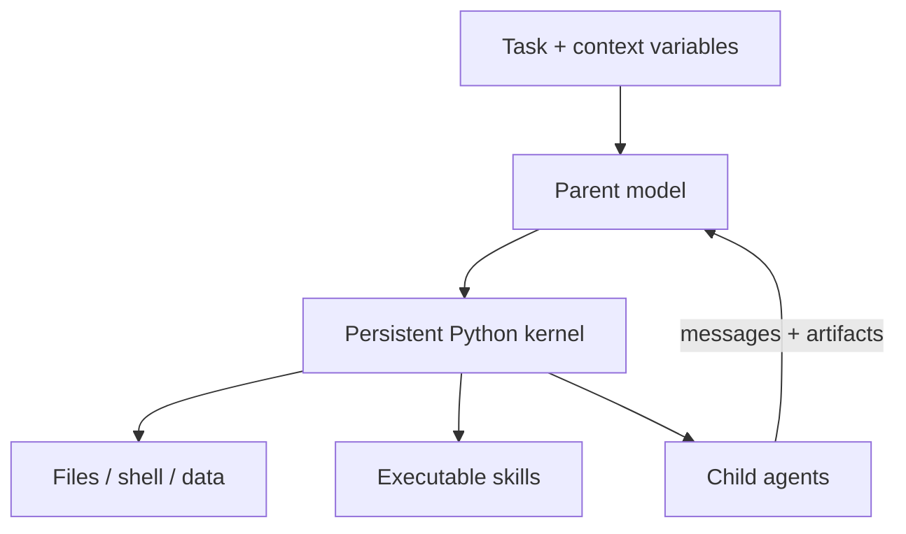

The important idea is:

> **Context becomes data the model can operate on, not one enormous prompt the model must repeatedly swallow.**

Each child has an independent context and session directory. The parent’s active context stays focused while durable Python state, files, and child handles survive across tool calls and compaction.

### 2. Continual Harness

Prime Agent’s refinement flow reviews a trajectory and proposes small, evidence-backed changes to supplemental harness state:

- supplemental prompts;
- memories;
- reusable skill descriptions;
- reusable subagent specifications.

The base system prompt remains immutable, refinement history is recorded, and snapshots support rollback. This is a concrete implementation reference for H4 RefineLoop.

```text
trajectory → evidence → proposed refinement → review → versioned state → next run
```

The phrase **evidence-backed and reviewable** matters. A failed run should not be allowed to rewrite global behavior from an unverified guess.

### Supporting architecture

Prime Agent separates:

- terminal or JSON/RPC clients;
- a supervisor for routing, recovery, and cross-agent messages;
- one worker per root session tree;
- `AgentSession` runtimes for model calls, queues, tools, goals, compaction, and transcripts;
- persistent Python kernels;
- independent child-agent sessions;
- JSONL session logs and artifacts.

This supports detached and long-running agents, messages between agents, persistent goals, schedules, and bounded autonomous continuation.

Prime Agent’s documentation is explicit that its worker and kernel process boundaries provide lifecycle and failure containment, **not security isolation**. Model-generated Python and project commands normally run with the worker user’s operating-system permissions. When incorporated into Simple Code, Prime Agent should run inside a Simple Code-managed external sandbox.

References: [Prime Agent architecture](https://github.com/PrimeIntellect-ai/prime-agent/blob/main/packages/coding-agent/docs/architecture.md) and [RLM programming model](https://github.com/PrimeIntellect-ai/prime-agent/blob/main/packages/coding-agent/docs/rlm.md).

### Recommended Simple Code integration

Treat Prime Agent as an `AgentRunner` adapter rather than allowing it to own the entire platform lifecycle.

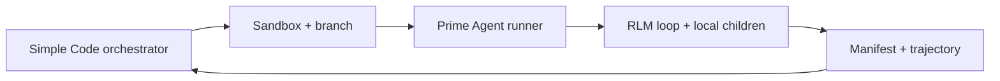

Recommended ownership:

| Concern | Owner |
|---|---|
| Cross-ticket task DAG and scheduling | Simple Code |
| Branch/worktree and sandbox lifecycle | Simple Code |
| Credentials, resource policy, and network policy | Simple Code |
| Model-facing programmatic reasoning loop | Prime Agent |
| Python working state and local context transformations | Prime Agent |
| Task-local child reasoning | Prime Agent, within policy |
| Cross-sandbox workers and integration | Simple Code |
| Durable organization-level memory promotion | Simple Code review/policy layer |

Avoid double orchestration. Use two explicit modes:

1. **Task-local recursion:** Prime Agent may spawn research, inspection, or review children inside one task sandbox. Parallel children should be read-only unless they have distinct workspaces.
2. **Platform-level parallelism:** any child that needs to write independently becomes a Simple Code task with its own branch and sandbox.

Simple Code can ingest Prime Agent’s trajectory and refinement proposal, but should decide whether a lesson remains task-local, becomes repository memory, is packaged as a reviewed skill, or is rejected. That prevents one noisy trajectory from silently poisoning every future project.

### How to present Prime Agent in under two minutes

Use one diagram and three statements:

1. **RLM:** context is programmable external state inside a persistent Python environment.
2. **Recursive agents:** focused children act like programmatic reasoning calls with independent contexts.
3. **Continual Harness:** completed trajectories can produce small, versioned, reviewable improvements to prompts, memories, skills, or subagent specifications.

Then connect it to the demo:

> “We just built RecoveryLoop and RefineLoop manually. Prime Agent is an open-source example of turning those ideas into a persistent programming model.”

Do not live-demo Prime Agent in the same 47-minute core. The DeepSeek Harness implementation remains the main story; Prime Agent is evidence that the principles generalize.

---

## 11. The live demo story

Use one continuous, understandable feature such as team invitations.

### Example ticket

```text
ENG-42 — Add team invitations

Acceptance criteria:
- admins can invite users;
- invitation tokens expire after 48 hours;
- duplicate invitations are rejected;
- API and UI feedback are included;
- automated tests are required.
```

### Demo beat 1 — Naked model

Ask the model to implement the feature without repository or execution access. It can reason about the task, but the result is not a verified software change.

### Demo beat 2 — Give it the repository and execution

Enable file search, read/write, terminal, tests, lint, and type checking. Let the audience see the inspect–change–test loop.

### Demo beat 3 — Make the ticket durable state

Let the planner turn the ticket into implementation tasks:

```text
ENG-42
├── schema / migration
├── invitation service
├── API
├── UI
└── tests
```

The ticket is not merely an integration. It is a durable unit of context, state, accountability, and completion.

### Demo beat 4 — Spawn bounded workers

Show backend, frontend, and test sessions with visibly different contexts. Give each parallel writer a distinct branch/worktree and sandbox. On screen, display three identities together:

```text
Agent context: backend-worker
Git branch:     agent/eng-42-backend
Sandbox:        sbx-7f3...
```

This demonstrates that context isolation, change isolation, and execution isolation are separate decisions. Merge through one integrator and run the acceptance suite again from a clean verification sandbox.

### Demo beat 5 — Trigger a deterministic failure

Do not hope the model happens to fail. Prepare an acceptance test that reliably exposes a missing requirement:

```text
FAIL test_duplicate_invitation
expected: 409
received: 201
```

The desired visible loop is:

```text
failure → inspect → diagnose → change → rerun → pass
```

### Demo beat 6 — Show observability

Expose the trace and a compact scoreboard:

| Harness | Tests | Human interventions | Failures recovered | Tool calls | Time | Cost |
|---|---:|---:|---:|---:|---:|---:|
| Bare | 0 | — | 0 | 0 | — | — |
| DevLoop | 6/8 | 2 | 1 | 17 | demo value | demo value |
| Full | 8/8 | 0 | 2 | 41 | demo value | demo value |

Use actual run data. Do not present rehearsed placeholder values as scientific results.

### Demo beat 7 — Extract a reusable lesson

Turn the recovery into a stored skill or repository-specific memory. Give the system a related task and show that the lesson is retrieved.

### Demo beat 8 — Finish on a completed outcome

```text
ENG-42 ✅

Implementation complete
8/8 acceptance tests passing
PR created
Trace attached
Cost: ...
Duration: ...
```

Do not end on an eval chart. End on a verified result, then zoom out to the architecture that produced it.

---

## 12. Evaluation: measure whether the problem was solved well

This section operationalizes the core thesis.

### A practical scorecard

| Dimension | What it asks | Possible measure |
|---|---|---|
| Task correctness | Did it solve the requested problem? | Acceptance-criteria pass rate |
| Functional quality | Does the output behave correctly? | Tests, simulations, human review |
| Consistency | Does it work across repeated runs and task variants? | Success rate over an eval set |
| Robustness | Can it handle ambiguity and local failures? | Recovery rate by failure class |
| Cost efficiency | Is the outcome economically useful? | Cost per verified successful task |
| Time efficiency | Is it fast enough for the workflow? | Wall-clock time to verified success |
| Human effort | How much rescue or review is necessary? | Interventions and review minutes |
| Safety | Did it remain inside permissions and constraints? | Policy violations / unsafe actions |
| Traceability | Can we explain and audit the work? | Complete trace and artifact coverage |
| Maintainability | Is the result suitable for the existing system? | Review score, regressions, complexity |

### The denominator matters

Do not optimize only for the number of correct outputs. Optimize **cost per verified successful outcome**.

For a repeated workflow:

$$
\text{Cost per Verified Success}
=
\frac{\text{Total inference + tool + infrastructure + review cost}}
{\text{Number of accepted outcomes}}
$$

A cheaper model that requires many retries and human rescues may be more expensive per successful task. A stronger model with a simple harness may beat a weaker model surrounded by excessive orchestration. Measure the complete system.

### Reliability is statistical

One successful stage demo is evidence of possibility, not consistency. For meaningful evaluation:

1. define representative tasks and acceptance criteria;
2. run multiple attempts or controlled variants;
3. preserve every trajectory, including failures;
4. separate task failure from infrastructure failure;
5. compare model-plus-harness configurations;
6. report uncertainty and failure classes, not only averages.

### Useful workshop metrics

- task completion;
- acceptance tests passed;
- time to verified success;
- total cost;
- tool calls and model calls;
- human interventions;
- local failures encountered;
- failures recovered;
- unnecessary actions;
- trace completeness;
- reusable lessons extracted.

---

## 13. Concepts from the handwritten notes

The notebook pages contain several valuable threads. They fit into the workshop as follows.

### Trajectory refinement

The notes distinguish:

- **Trajectory A:** actions plus successful outcome;
- **Trajectory B:** message/action plus failure;
- **Trajectory C:** recovery plus successful result.

These feed a refine step that may update prompts, skills, memory, or a knowledge base through recursive sessions. This is the conceptual basis of RefineLoop.

### Long-horizon performance and context sharing

The notes connect long-horizon performance with subagent context sharing. The presentation should sharpen this into:

> Do not ask how much context agents can share. Ask what information each agent needs, when it needs it, and what must return to the parent as durable state.

### Standardized evaluation with verifiers

The notes call for standardized evaluations and verifiers. This directly supports the central thesis: agent quality must be demonstrated through outcomes, not perceived fluency.

### Out-of-loop autoresearch

Autoresearch provides a clean example of a powerful but simple closed loop:

```text
hypothesis → modify → run experiment → measure → keep/revert → repeat
```

Its lesson is that a clear environment and objective metric can produce sophisticated behavior without an excessively complicated topology.

### Agent context management

The notes identify context management as a first-class topic. It should be shown through the subagent demo rather than taught only abstractly.

### DSPy, Prime/RL, evals, meta harness, continual harness

Treat these as different perspectives on the same skeleton:

| Idea or system | What it helps explain |
|---|---|
| DSPy | AI systems as programs that can be measured and optimized |
| RL / Prime-style approaches | Reward signals, training loops, and policy improvement |
| Verifier environments | Objective or programmatic evaluation of outcomes |
| RLM-style context operations | Context as external state that can be searched and transformed |
| Meta harness | Selecting or composing a task-appropriate runtime |
| Continual harness | Refining prompts, memory, skills, or policy from trajectories |

Do not turn this into a framework comparison. Use each reference only when it explains something the audience has just seen.

### Plan → Act → Critique

The notes describe a simple loop involving planning, acting, and critique, with parent and subagent sessions plus state management. This can be expressed as:

```text
plan → act → observe → critique/verify → update state → continue or stop
```

Critique alone is not proof. Wherever possible, ground critique in executable tests, schemas, constraints, or human review.

### Hardware / deployment questions

The notes mention dynamic model selection, local hardware, a Mac Studio-class local setup, cloud/local endpoints, and a small cluster with a lead node. These are useful for the local-versus-frontier discussion, but should not consume the core demo.

Use one slide or spoken aside:

| Local model | Frontier model | Hybrid routing |
|---|---|---|
| Privacy and predictable marginal cost | Stronger reasoning and longer reliable trajectories | Route each step by difficulty, privacy, latency, and cost |
| More harness engineering may be needed | Higher per-call dependency/cost | Often the practical production design |

Frame dynamic model selection as another harness decision:

> Which model is sufficient for this decision under the required quality, privacy, latency, and cost constraints?

---

## 14. Research references: how to use them without losing the room

Potential references include ReAct, Reflexion, DSPy, RLM, verifier-based evaluation, long-horizon agent evaluations, continual harnesses, ARC-style environments, and Autoresearch.

They are supporting evidence, not the curriculum.

The audience should leave understanding five things:

1. why a model alone is not an agent;
2. what components make up a harness;
3. why context, tools, state, verification, and recovery matter;
4. why harness design determines consistency and long-horizon reliability;
5. how these pieces combine into a small software factory.

Before presenting, validate any time-sensitive benchmark numbers, product capabilities, API details, and framework names against primary sources. Avoid building the narrative around a headline number that may be disputed or updated.

---

## 15. Demo reliability plan

The learning journey may begin at zero; the repository should not.

### Prepare recoverable checkpoints

```text
00-empty
01-tools
02-working-app
03-ticket-planned
04-subagents
05-known-failure
06-recovered
07-learned-skill
08-final
```

Use Git tags, branches, or equivalent snapshots. Rehearse moving between them without destroying uncommitted material.

### Pre-cache boring dependencies

- dependencies and lockfiles;
- local model weights;
- containers and images;
- package-manager caches where permitted;
- credentials and authenticated sessions;
- ticketing integration;
- environment variables;
- known ports;
- backup internet or offline mode;
- a pre-recorded 30–60 second clip of each wow moment.

The only failure intended for the stage should teach harness engineering. A registry timeout or expired token does not.

### Make the educational failure deterministic

Prepare a failing acceptance test or initially hidden constraint. Rehearse the expected failure message and recovery path. Keep a recovered checkpoint available if the live model chooses an unexpected strategy.

### Rehearse three paths

1. **Happy path:** the complete live demo works.
2. **Recovery path:** a component fails and you restore from the nearest checkpoint.
3. **Offline path:** live APIs are unavailable, so you use recorded traces and execute only local verification.

### Protect the ending

At minute 44, move toward the final verified outcome regardless of where the live run has reached. The audience should experience closure.

---

## 16. What deliberately stays out

- A deep lecture on every named paper or framework.
- Five live framework comparisons.
- A large swarm added only for spectacle.
- Claims that self-critique is equivalent to verification.
- A benchmark race presented as a controlled model comparison when the harnesses differ.
- A self-modifying meta-harness built live.
- New required concepts inside the final 13-minute buffer.
- Architecture whose complexity has no measurable contribution to the outcome.

If comparing DeepSeek Harness with another coding agent, describe it honestly as a comparison of complete agent systems unless the model, tools, context, budgets, environment, and verifier are controlled.

---

## 17. Presenter lines worth keeping

Use only a few; repetition will make them memorable.

> **The intelligence is in the model. The reliability comes from the system around it.**

> **Agents are loops, not responses.**

> **A capable model can solve a problem. A good harness makes the solution dependable.**

> **Subagents are not primarily more intelligence. They are bounded contexts for bounded jobs.**

> **A session isolates context. A branch isolates changes. A sandbox isolates execution.**

> **A local failure does not have to become a task failure.**

> **We did not fine-tune the model. We improved the system around it.**

> **Everything in this diagram except the model is harness engineering.**

> **Build the smallest harness that closes the loop reliably.**

> **The model is not the product. The harness is how the model becomes part of a dependable system.**

---

## 18. Suggested opening and closing

### Opening

> We already have models that can write, reason, plan, code, and debug. Yet one model call is not a software engineer. Why? Because capability is not the same thing as dependable execution.
>
> Most of us are not trying to solve Navier–Stokes every morning. We are trying to complete ordinary, valuable work correctly—again and again—without spending a fortune or supervising every step. That gap between “the model can” and “the system reliably does” is where harness engineering lives.

### Closing

> At the beginning, we had a prompt, a model, and text. Now we have a system that can receive work, understand context, decompose it, use tools, coordinate bounded workers, test its output, recover from mistakes, record what happened, and become better prepared for the next task.
>
> The model was capable from the start. What changed was our ability to turn that capability into a dependable outcome.
>
> **Build the loop. Measure the outcome. Learn from the trajectory. Improve the system.**

---

## 19. Final presentation design principle

Every added component must answer one visible question:

> **What did this improve: correctness, consistency, cost, speed, safety, recoverability, or human effort?**

If the audience cannot see what a component bought us, it is architecture theatre.

The workshop succeeds if people leave with a clear mental model:

```text
High-quality agent system
= capable model
+ appropriately engineered environment
+ feedback and verification
+ recovery and state
+ measured continual improvement
```

And with the confidence to say:

> “I can begin with one loop, one verifier, and one useful problem—and earn the rest of the complexity.”
