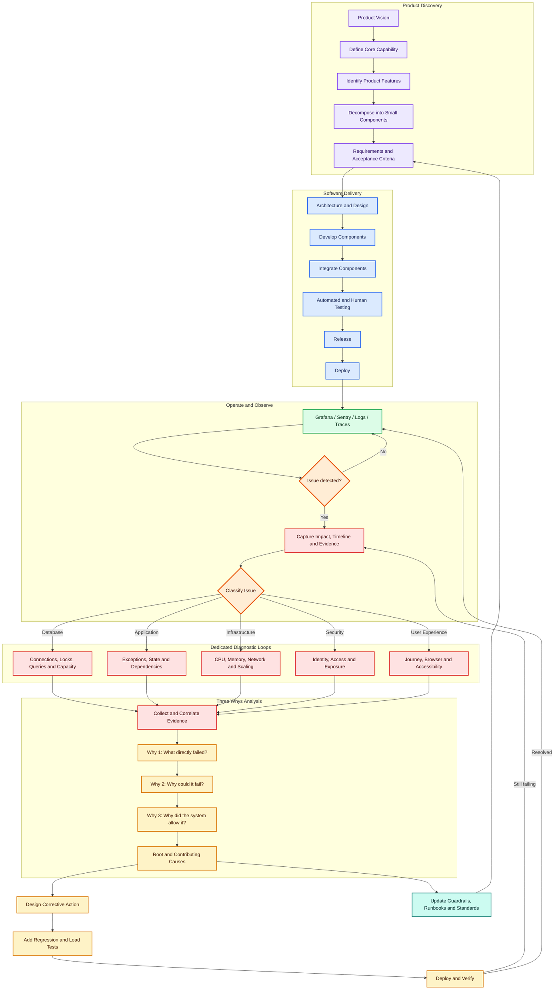

# SDLC and the software factory

Two diagrams for the workshop: how a product is cut into work, how failures loop back, and where Grill Me sits as the human–agent alignment gate.

Toyota’s method is usually the Five Whys. These diagrams use a bounded **Three Whys** so the factory does not fall into an unbounded rabbit hole.

## 1. Product SDLC and issue loops

Vision becomes features. Features become small components. After release, observability classifies each failure into a dedicated diagnostic loop. Three Whys find the cause. The fix and the preventive control feed the next build.

Example: one hundred people sign in at once and the system is unavailable.

1. Why 1 — database sessions are exhausted.
2. Why 2 — the pool is undersized, or sessions leak.
3. Why 3 — there is no capacity model and no concurrency test.

The factory then fixes session lifecycle, tunes the pool, adds a load test, and alerts on saturation.

## 2. Product flow through the software factory

The CEO or CTO owns the vision board. Product engineers turn it into journeys and epics. Grill Me is the skill that pulls judgment from the human into the agent — one question at a time, with a recommended answer — until both share a spec. Only then do tickets enter the developer DAG.

```mermaid
flowchart TB
    subgraph HumanInput[Human Context and Judgment]
        LEADER[CEO or CTO]
        PE[Product Engineer]
        DEV[Software Developer]
        REVIEWER[Human Reviewer]
    end

    subgraph ProductDefinition[Product Definition]
        LEADER --> VISION[Vision Board]
        VISION --> PE
        PE --> JOURNEYS[User Flows and Journeys]
        JOURNEYS --> EPICS[Product Epics]
    end

    subgraph Alignment[Grill Me Alignment Loop]
        EPICS --> GRILL1[Ask One Epic Question]
        GRILL1 --> REC1[Recommend an Answer]
        REC1 --> DECISION1{Aligned?}
        DECISION1 -->|No| GRILL1
        DECISION1 -->|Yes| FEATURES[Approved Features]

        FEATURES --> GRILL2[Resolve Boundaries and Edge Cases]
        GRILL2 --> REC2[Recommend an Answer]
        REC2 --> DECISION2{Shared understanding?}
        DECISION2 -->|No| GRILL2
        DECISION2 -->|Yes| TICKETS[Implementation Tickets]
    end

    subgraph DeveloperFlow[Developer DAG]
        TICKETS --> DEV
        DEV --> UNDERSTAND[Understand Expected Outcome]
        UNDERSTAND --> MAP[Map Ticket to Codebase]
        MAP --> SKILLS[Select Skills and Tools]
        SKILLS --> CHANGESET[Identify Required File Changes]
        CHANGESET --> REUSE[Find Existing APIs and Patterns]
        REUSE --> DESIGN[Validate Architecture Standards]
        DESIGN --> RISKS[Identify Risks and Tests]
        RISKS --> PLAN[Create Implementation Plan]
    end

    subgraph ProductionLine[Software Factory]
        PLAN --> IMPLEMENT[Implement Small Components]
        IMPLEMENT --> TESTS[Unit, Integration, E2E and Load Tests]
        TESTS --> QUALITY{Quality gates pass?}
        QUALITY -->|No| IMPLEMENT
        QUALITY -->|Yes| DRAFT[Create Draft Pull Request]
        DRAFT --> REVIEWER
        REVIEWER --> REVIEW{Approved?}
        REVIEW -->|Changes requested| IMPLEMENT
        REVIEW -->|Yes| MERGE[Merge and Deploy]
        MERGE --> MONITOR[Observe Runtime]
    end

    subgraph LearningLoop[Factory Learning Loop]
        MONITOR --> ISSUE{Issue detected?}
        ISSUE -->|No| MONITOR
        ISSUE -->|Yes| RCA[Diagnostic DAG and Three Whys]
        RCA --> KNOWLEDGE[Update Skills, Standards and Runbooks]
        KNOWLEDGE --> MAP
        RCA --> TICKETS
        RCA --> EPICS
    end

    classDef human fill:#ede9fe,stroke:#7c3aed,color:#2e1065,stroke-width:2px
    classDef product fill:#dbeafe,stroke:#2563eb,color:#172554,stroke-width:2px
    classDef grill fill:#fef3c7,stroke:#d97706,color:#451a03,stroke-width:2px
    classDef technical fill:#ccfbf1,stroke:#0f766e,color:#042f2e,stroke-width:2px
    classDef factory fill:#dcfce7,stroke:#16a34a,color:#052e16,stroke-width:2px
    classDef feedback fill:#ffedd5,stroke:#ea580c,color:#431407,stroke-width:2px
    classDef decision fill:#fee2e2,stroke:#dc2626,color:#450a0a,stroke-width:3px

    class LEADER,PE,DEV,REVIEWER human
    class VISION,JOURNEYS,EPICS,FEATURES,TICKETS product
    class GRILL1,REC1,GRILL2,REC2 grill
    class DECISION1,DECISION2,QUALITY,REVIEW,ISSUE decision
    class UNDERSTAND,MAP,SKILLS,CHANGESET,REUSE,DESIGN,RISKS,PLAN technical
    class IMPLEMENT,TESTS,DRAFT,MERGE,MONITOR factory
    class RCA,KNOWLEDGE feedback
```

Grill Me asks one question at a time, recommends an answer, and walks each branch of the decision tree until the human and the agent share a language. Then — and only then — the factory cuts tickets.
